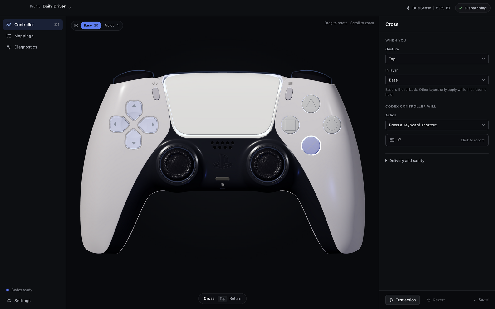
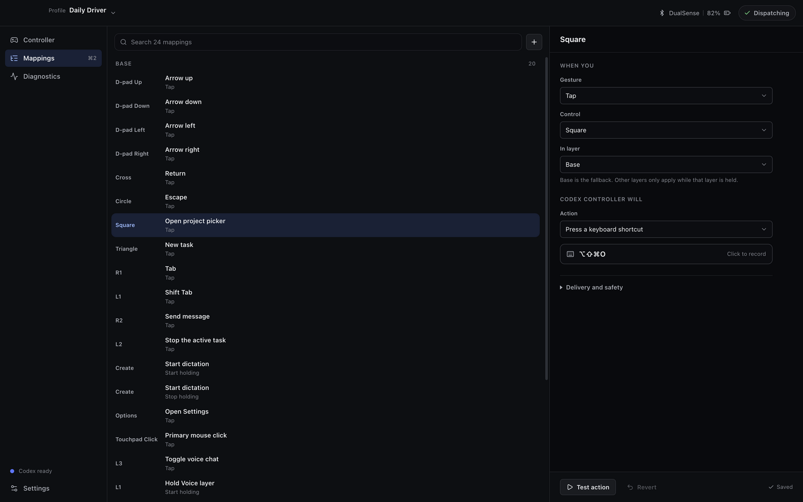
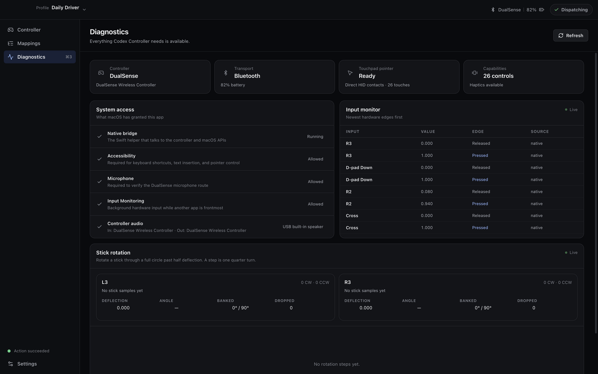
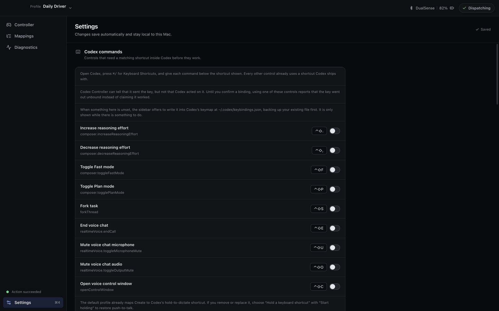

# Codex Controller

Codex Controller turns a PlayStation 5 DualSense into a physical command
surface for the Codex desktop app on macOS. It combines an Electron, React, and
Three.js interface with a small Swift helper for Apple controller, audio,
haptic, light, and Accessibility APIs.

> [!IMPORTANT]
> Codex Controller is an independent open-source project. It is not affiliated
> with, sponsored by, or endorsed by OpenAI or Sony Interactive Entertainment.
> OpenAI and Codex are trademarks of OpenAI. PlayStation and DualSense are
> trademarks or registered trademarks of Sony Interactive Entertainment.

## In action



_Screenshots use synthetic profiles, controller activity, and system status. No
user data is shown._

<details>
<summary><strong>Explore mappings, diagnostics, and settings</strong></summary>

### Mappings

Browse every layer, search mappings, and edit a selected controller action in
place.



### Diagnostics

Inspect controller health, macOS permissions, touchpad readiness, and live input
edges.



### Settings

Review Codex shortcut bindings and manage local profiles and controller
behavior.



</details>

## What it does

- Maps DualSense buttons, triggers, sticks, stick rotation, chords, holds, and
  touchpad input to Codex commands and ordinary macOS input.
- Provides seven mapping layers, reusable profiles, import/export, action
  sequences, conflict detection, and guarded consequential actions.
- Uses the controller touchpad as an optional relative pointer with physical
  click support.
- Drives Codex through its own registered shortcuts and published deep links;
  it does not inject code, patch Codex, read credentials, or use private Codex
  IPC.
- Offers physical light and haptic feedback, live diagnostics, and accessible
  controls for every selectable controller surface.
- Includes experimental, explicitly gated DualSense audio verification. Normal
  controller use does not require microphone access.

## Requirements

- macOS 14 or newer
- A PlayStation 5 DualSense controller connected over USB or Bluetooth
- Node.js 22 or newer and Xcode command-line tools for development
- Accessibility permission for posting configured shortcuts, text, or pointer
  events

The released universal build supports both Apple silicon and Intel Macs.

## Install a release

Download the universal DMG from the latest GitHub release, open it, and move
`Codex Controller.app` to `/Applications`. Release artifacts are signed with a
Developer ID certificate, notarized by Apple, and published with SHA-256
checksums and a CycloneDX SBOM.

The first renamed release uses the bundle identifier
`com.parthjadhav.CodexController`. macOS may therefore ask existing users to
grant permissions once for the new application identity. Saved profiles from
the predecessor app are copied non-destructively on first launch.

## Develop

```sh
npm ci
npm run native:build
npm run dev
```

Connect the controller before launch or pair it in macOS Bluetooth settings.
The app remains usable for profile editing and visual inspection without
controller or Accessibility permission.

## Test and build

```sh
npm test
swift test --package-path native
npm run build:all
```

Create signed universal artifacts on a Mac with a Developer ID Application
certificate:

```sh
npm run dist
./scripts/verify-release-artifacts.sh --signed
```

`npm run dist` builds one universal Swift helper and packages both a DMG and a
ZIP containing arm64 and x86_64 application binaries. Apple credentials are
required only for notarization; see [RELEASING.md](RELEASING.md).

For local installed-app testing:

```sh
npm run package
```

This command replaces `/Applications/Codex Controller.app` only after checking
its bundle identifier. Use `npm run install:mac -- --dry-run` to validate the
operation without changing `/Applications`.

## Default controller layout

| Control | Gesture | Result |
| --- | --- | --- |
| D-pad | Tap | Arrow keys |
| Cross / Circle | Tap | Return / Escape |
| Square | Tap | Open project picker |
| Triangle | Tap | New task |
| R1 / L1 | Tap | Tab / Shift-Tab |
| R2 | Tap | Submit |
| L2 | Tap | Stop with Escape |
| Create | Hold | Hold Codex dictation shortcut |
| Options | Tap | Codex settings |
| Touchpad | Click | Primary mouse click |
| L3 | Click | Toggle Codex voice chat |
| R3 | Rotate | Increase/decrease reasoning effort |
| L1 | Hold | Temporarily activate the Voice layer |

Some Codex commands ship without a default shortcut. Codex Controller can add
only the missing bindings used by the active profile to
`~/.codex/keybindings.json` after an explicit user action. It validates the
file, refuses conflicts, writes atomically, and backs up an existing file as
`keybindings.json.codex-controller-backup.json`.

Codex command names and shortcut behavior can change between Codex releases.
All mappings remain editable, and the app reports unconfirmed bindings rather
than claiming that an unobservable Codex action succeeded. See
[Interoperability](docs/INTEROPERABILITY.md).

## Architecture

```text
DualSense (USB or Bluetooth)
        │
        ▼
Swift ControllerBridge
GameController · CoreAudio · CoreHaptics · Accessibility
        │ JSONL over stdio
        ▼
Electron main process
profiles · safety · action validation · Codex keymap · secure IPC
        │ context-isolated preload
        ▼
React renderer
Three.js controller scene · mappings · diagnostics
```

The renderer is sandboxed and has no Node.js access. The preload exposes a
narrow typed API, IPC payloads are validated, external navigation is denied by
default, WebHID permission is limited to Sony devices, and profile imports are
strictly validated.

## Privacy and safety

Codex Controller has no account system, analytics, advertising, telemetry, or
networking client. It stores mapping profiles locally and captures no audio for
Codex dictation or voice chat. Explicit audio verification samples are analyzed
in memory and discarded.

Read [PRIVACY.md](PRIVACY.md) for the data boundary and [SECURITY.md](SECURITY.md)
for responsible disclosure.

## Third-party assets

The interactive DualSense model is “Playstation 5 Dualsense” by
AHarmlessPotato under CC BY 4.0. Its full attribution and content hash are in
[the asset record](docs/11-3d-controller-asset.md) and in the packaged app.
Additional notices are in [THIRD_PARTY_NOTICES.md](THIRD_PARTY_NOTICES.md).

## Contributing

Contributions are welcome. Start with [CONTRIBUTING.md](CONTRIBUTING.md) and the
[Code of Conduct](CODE_OF_CONDUCT.md).

## License

Codex Controller source code is released under the [MIT License](LICENSE).
Third-party assets retain their respective licenses.
